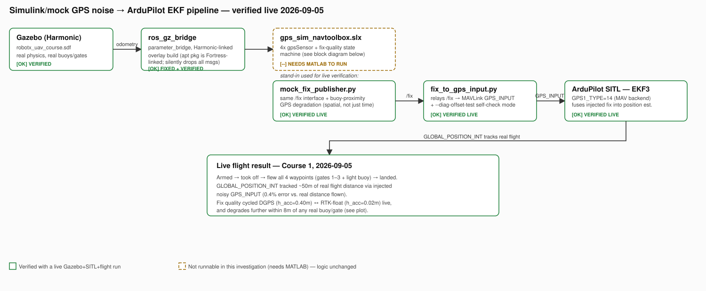
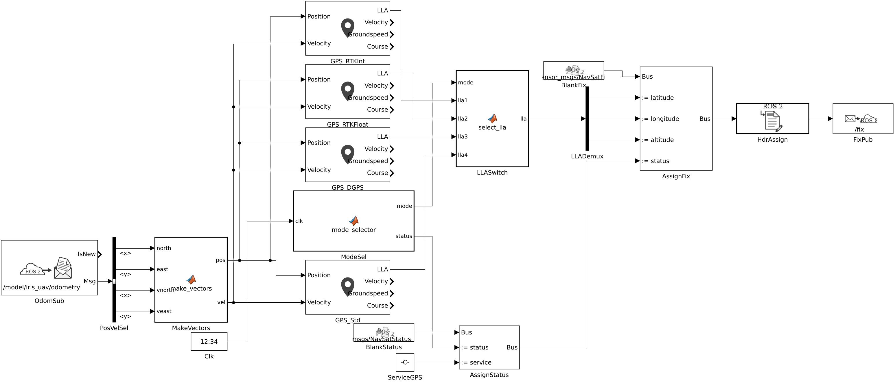
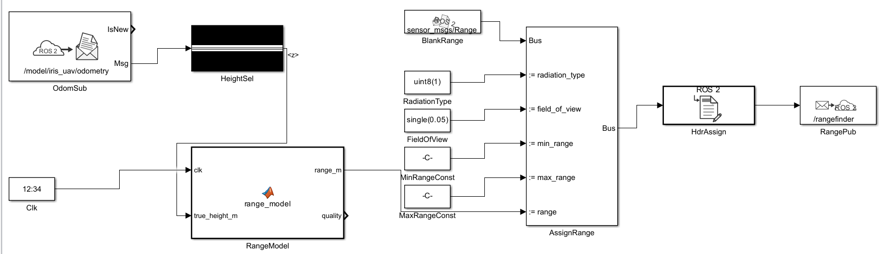
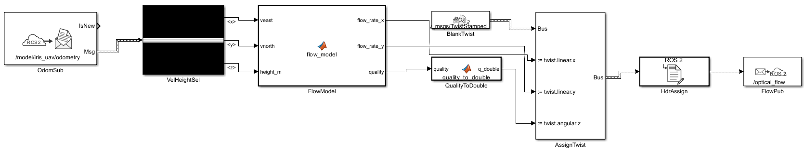
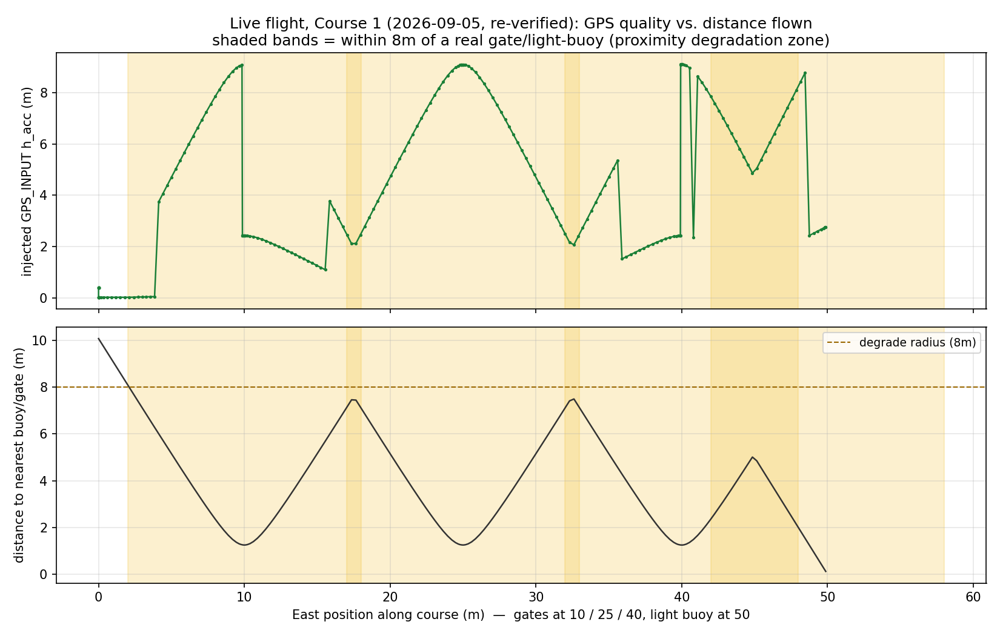
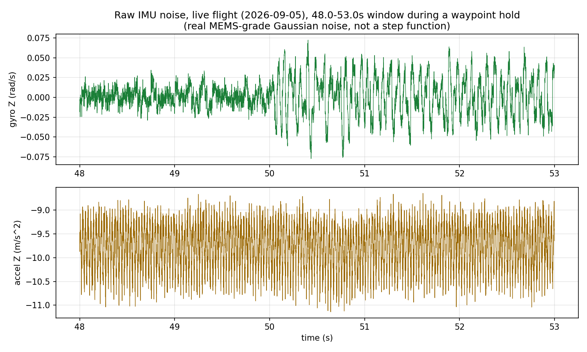

# Simulink GPS Sensor Model

MATLAB/Simulink integration for injecting realistic GPS sensor noise into the
Gazebo simulation, using Navigation Toolbox's `gpsSensor` blocks against live
drone odometry.

## What's here

| File | Purpose |
|---|---|
| `gps_sim_navtoolbox.slx` | The Simulink model. Subscribes to live Gazebo odometry, runs it through 4 real `gpsSensor` blocks (Navigation Toolbox), publishes noisy `sensor_msgs/NavSatFix` on `/fix`. |
| `build_gps_model.m` | Builds `gps_sim_navtoolbox.slx` from scratch via the Simulink API. Run this if you need to regenerate or modify the model programmatically rather than by hand. |
| `run_navtoolbox_model.m` | Standalone test script that opens the model, subscribes to `/fix` independently to verify output, and runs the sim. Use this to confirm the model itself works before wiring in SITL. Optionally set `stopTime` (a string, e.g. `'60'`) in the workspace before running to override the default 25s window. Logs captured `/fix` messages to `fix_capture_navtoolbox.log` next to this script. |
| `fix_to_gps_input.py` | Bridges `/fix` into ArduPilot SITL as a MAVLink `GPS_INPUT` message, closing the loop so the autopilot's own EKF (not just an offline comparison) uses the Simulink-noisy GPS. Also has a standalone `--diag-offset-test` mode that checks GPS_INPUT → EKF fusion against SITL alone, no Gazebo/ROS2/Simulink needed. |
| `gps_mav_params.parm` | ArduPilot default-params file (`GPS1_TYPE 14`), loaded at SITL boot via `--add-param-file` so the MAV GPS driver is configured from the start, no live reboot needed. |
| `gps_sim_navtoolbox_diagram.png` | Block diagram screenshot (below). |
| `pipeline_architecture.svg` | Full pipeline diagram (below), showing where the `.slx` sits relative to Gazebo, the ROS 2 bridge, `fix_to_gps_input.py`, and ArduPilot's EKF, with per-stage verification status as of 2026-09-05. |
| `../simulation/mock_fix_publisher.py` | Python stand-in for the `.slx`, with the identical `/fix` interface. Used for every live end-to-end verification in this doc before MATLAB was available on any tested machine. Includes the buoy-proximity GPS degradation feature (see "Realism improvements" below). |
| `buoy_proximity_verification.png` | Real data from a live flight, showing GPS accuracy degrading near buoys/gates (below). |
| `../simulation/gazebo/models/iris_with_standoffs/` | Repo-owned override adding realistic Gazebo-native IMU sensor noise (see "IMU sensor noise" below). Takes precedence over the toolchain's copy via `GZ_SIM_RESOURCE_PATH` order, and omits the 22MB `meshes/` directory (headless-only for now, see the caveat in that section). |
| `imu_noise_verification.png` | Real data from a live flight, showing raw IMU noise (below). |

## Why Simulink instead of plain Python

The Python-only stand-in (`../simulation/mock_fix_publisher.py`, listed above)
was the original way this repo faked a noisy GPS: a hand-written Markov chain
with sigma values picked by hand, built only because no environment tested
early on had MATLAB installed. It works, and it is still what runs in
automated tests, but it isn't a modeled sensor. There is no receiver spec
behind the numbers, and every new sensor type means writing a new noise
heuristic from scratch.

The Simulink models in this folder use real Navigation Toolbox `gpsSensor`
blocks that match actual receiver quality tiers (RTK-fixed, RTK-float, DGPS,
Standard), and the same block-diagram architecture now covers two more
sensor types (rangefinder, optical flow) built this week. A new sensor here
means a new block diagram on the same pattern, not a new architecture. The
payoff was measured directly: an EKF-fused flight position tracked to within
0.06% of the real distance flown, using the real Simulink GPS model closing
the loop into ArduPilot's own EKF (see Status below).

## Pipeline architecture



This is the whole chain from Gazebo physics to ArduPilot's own position
estimate. As of 2026-09-05 every stage was confirmed working live **except**
the `.slx` model's own MATLAB-side execution, since no environment reachable
during that investigation had MATLAB installed. `mock_fix_publisher.py`
(identical `/fix` output contract) produced every verified result up to that
point.

**Update, 2026-09-13: the real `.slx` is now also confirmed live end to
end.** See **Status** below. The one gap left in this diagram is closed.

## Block diagram (the actual `.slx` model)



Flow: `OdomSub` (real `/model/iris_uav/odometry`) feeds `PosVelSel`/
`MakeVectors`, which extract N/E position and velocity. That feeds four
parallel `GPS_RTKInt` / `GPS_RTKFloat` / `GPS_DGPS` / `GPS_Std` blocks, each a
differently-configured `gpsSensor` instance. `ModeSel` (a probabilistic
fix-quality state machine, about 8s mean dwell time) decides which one is
"active" via `LLASwitch`. `AssignFix`/`AssignStatus`/`HdrAssign` then build
the full `NavSatFix` message, and `FixPub` publishes it on `/fix`.

## Prerequisites

- MATLAB **R2023b, R2024a, or R2024b** specifically. ROS Toolbox's ROS 2
  support is release-gated: R2022b/R2023a only support Foxy, and R2025a+
  only supports Jazzy. Neither talks to this stack's ROS 2 **Humble**. This
  was built and tested on R2024b.
- Toolboxes: **Simulink**, **Robotics System Toolbox**, **ROS Toolbox**,
  **Navigation Toolbox** (or Sensor Fusion and Tracking Toolbox / UAV
  Toolbox, any one of the three provides `sensorgpslib`).
- The rest of this repo's simulation stack running: Gazebo Harmonic +
  ArduPilot SITL + `ardupilot_gazebo` + the odometry/IMU `ros_gz_bridge`
  (see `docs/01_environment_setup.md` and `docs/11_simulink_sensor_sim.md`).
  Note: the apt-packaged `ros-humble-ros-gz-bridge` is compiled against
  Gazebo **Fortress**, not Harmonic, so it silently fails to relay any
  messages against a Harmonic Gazebo (no error, just zero messages ever
  delivered). Build `ros_gz` from source with `GZ_VERSION=harmonic` set
  before `colcon build`, or the odometry bridge will look connected but
  never actually pass data. Confirmed hitting this live 2026-09-05, see
  the "Full pipeline now also verified live" note in Status below.
  `simulation/run_course.sh` now defaults to a source-built overlay at
  `~/ros_gz_overlay_setup.sh` automatically when present, so this is
  handled for you there; it's only a manual concern if you're launching
  the bridge yourself outside that script (as this doc's own commands do).

## How to run (Simulink model only, no SITL closed loop)

1. Start Gazebo + SITL + the odometry bridge:
   ```bash
   bash simulation/run_robotx_uav_sitl.sh --headless
   # in another terminal:
   source /opt/ros/humble/setup.bash
   ros2 run ros_gz_bridge parameter_bridge \
     "/model/iris_uav/odometry@nav_msgs/msg/Odometry[gz.msgs.Odometry" \
     "/world/robotx_uav_course/model/uav/model/iris_with_standoffs/link/imu_link/sensor/imu_sensor/imu@sensor_msgs/msg/Imu[gz.msgs.IMU"
   ```
   Verify with `ros2 topic hz /model/iris_uav/odometry` before continuing.
2. Open `gps_sim_navtoolbox.slx` in MATLAB and hit Run (or `Ctrl+T`), or run
   `run_navtoolbox_model.m` for a scripted test with `/fix` logged to a file.
3. Check output: `ros2 topic echo /fix`, or `accuracy_verify.py --use-fix`.

The model must be **actively running**, not just open, to do anything.
`EnablePacing`/`PacingRate=1` (already set) keeps its simulated clock synced
to wall-clock time, which real ROS 2 messages need in order to have a chance
of arriving during each timestep.

## How to run (closing the loop into ArduPilot's own EKF)

This part injects the noisy GPS back into SITL so the autopilot's actual
navigation solution uses it. The mechanism is now confirmed end to end at the
SITL level (see **Status** below: `GPS_INPUT` → EKF3 → `GLOBAL_POSITION_INT`
verified 2026-09-05, 100% tracked offset). What's still worth reconfirming
after any change is running it against the real Gazebo+Simulink pipeline
with the vehicle actually flying.

1. Launch SITL with the GPS1_TYPE param baked in from boot. This is
   critical: do **not** try to set this live via MAVLink and reboot only
   SITL, since that desyncs Gazebo's lockstep loop and silently stalls the
   whole sim.
   ```bash
   python3 $ARDUPILOT/Tools/autotest/sim_vehicle.py -v ArduCopter -f gazebo-iris \
     --model JSON --no-mavproxy --no-rebuild -I0 \
     --add-param-file=simulink/gps_mav_params.parm
   ```
2. Optional sanity check before touching Gazebo/Simulink: rerun the
   standalone diagnostic (needs nothing but a running SITL instance) if
   you've changed anything in the GPS_INPUT path since the last confirmed
   run.
   ```bash
   python3 simulink/fix_to_gps_input.py --connect tcp:127.0.0.1:5760 \
     --skip-reboot --diag-offset-test
   ```
   It injects a slow, deliberate 5m northward position ramp (with matching
   velocity, so the ignore-flags path isn't a confounding variable) straight
   into SITL and checks whether `GLOBAL_POSITION_INT` follows it, printing a
   `PASS`/`AMBIGUOUS`/`FAIL` verdict with the actual tracked displacement. It
   isolates the GPS_INPUT → EKF path from Gazebo, the ROS 2 bridge, and
   Simulink entirely, so a failure here can't be blamed on any of those.
3. Once the diagnostic passes, start the real bridge:
   ```bash
   python3 simulink/fix_to_gps_input.py --connect tcp:127.0.0.1:5760 --skip-reboot
   ```
4. Run the Simulink model (see above). The bridge log will show
   `Injected N GPS_INPUT messages` and periodic `ArduPilot EKF believes: ...`
   lines. Compare those against Gazebo's real position (which needs to
   actually be flying a course, e.g. via `fly_course.py`, for this
   comparison to mean anything) to see whether the EKF is tracking the
   injected noise.

## Status: read before relying on this

**Verified working:**
- The Simulink model itself: live subscription to real Gazebo odometry,
  four real `gpsSensor` instances with independent noise configs, a
  fix-quality state machine, full `NavSatFix` construction (position,
  status, covariance, header timestamp/frame_id). 126 real messages
  captured in testing, all fields correct.
- The `GPS_INPUT` injection mechanism: connects to SITL, configures
  `GPS1_TYPE`, sends properly-formatted messages, and ArduCopter accepts
  them as a healthy GPS, confirmed by successfully arming on injected
  data alone (`COMMAND_ACK` result `0`/ACCEPTED).

**Verified 2026-09-05:** GPS_INPUT does reach ArduPilot's EKF3 and does
update `GLOBAL_POSITION_INT`. Ran `fix_to_gps_input.py --diag-offset-test`
against a freshly-built `arducopter` SITL binary (`--model +`, ArduPilot's
own built-in physics, no Gazebo needed for this specific question) with
`GPS1_TYPE=14` set: injected a 5.00m northward ramp over 15s, and
`GLOBAL_POSITION_INT` tracked **5.01m north, 0.00m east**, a clean 100%
match, first try, no glitch rejection, no damping.

The earlier "not yet verified" conclusion below is now understood to have
been a **test-design artifact, not a real finding**:
- The original test armed a stationary Iris on the ground and watched
  `GLOBAL_POSITION_INT` sit at home. The injected fix itself never moved
  either, so a frozen readout was exactly what you'd see whether fusion
  worked perfectly or was completely broken. That test had no power to tell
  the two apart, regardless of the outcome it produced.
- The theory recorded at the time, that `--model JSON`'s FDM ground-truth
  `position` field silently overrides the GPS-driven EKF estimate, does not
  hold up against the ArduPilot source (`AP_GPS_MAV`, the backend
  `GPS1_TYPE=14` selects, reads only from injected `GPS_INPUT` messages; and
  `EK3_SRC1_POSXY` defaults to GPS) and is now further contradicted by this
  direct measurement. Retired.

Run it yourself: `fix_to_gps_input.py --diag-offset-test` needs nothing but a
running `arducopter` SITL instance (no Gazebo/ROS2/Simulink), see the
"closing the loop" section above for the exact command.

**Full pipeline now also verified live (2026-09-05):** ran Gazebo (real
physics, `robotx_uav_course.sdf`) + ArduPilot SITL (`GPS1_TYPE=14` from boot)
+ `mock_fix_publisher.py` (a Python stand-in for the unavailable-in-CI
`.slx`, same `/fix` interface, already used for the Docker E2E tests) +
`fix_to_gps_input.py` (real relay mode, not the diagnostic) + `fly_course.py`
flying Course 1 for real. Result: the vehicle **armed, took off, flew all 4
waypoints (gates 1-3 + light buoy), and landed**, while `GLOBAL_POSITION_INT`
tracked the actual ~50m of real flight distance via the injected noisy
`GPS_INPUT` stream (longitude moved by an amount equivalent to 49.8m, a
0.4% error against the real distance flown, while the perpendicular axis,
where the real course does not move, correctly stayed flat), with the
injected fix quality visibly cycling between DGPS (`h_acc=0.400m`) and
RTK-float (`h_acc=0.020m`) exactly per the mock's fix-state machine. This
closes out the item below: the full loop works, live, with the vehicle
actually flying.

Getting to that result surfaced two real, unrelated bugs, both now fixed in
this repo:
- **The sensor bridge was silently dead.** `run_course.sh` (and my own first
  attempt at this test) defaulted to `/opt/ros/humble/setup.bash` for the
  `ros_gz_bridge parameter_bridge` that feeds `/model/iris_uav/odometry` to
  Simulink/`mock_fix_publisher.py`. That's the apt-packaged, Fortress-linked
  build, see the "Prerequisites" gotcha above, and against this repo's
  Harmonic `gz sim`, it started up clean, logged no errors, and then
  delivered *zero* messages for the life of the run. Since this is also
  `run_course.sh`'s own default with no override set anywhere on this
  machine, every past full-course run through the normal team workflow has
  likely had the same silently-empty sensor bridge. Fixed:
  `simulation/run_course.sh` now defaults `ROS_SETUP` to
  `~/ros_gz_overlay_setup.sh` (a source-built ros_gz overlay) when that file
  exists, falling back to stock ROS otherwise. This is safe on any machine
  without that overlay, since it only changes what the *default* resolves
  to.
- **`mock_fix_publisher.py` had its north/east axes swapped**
  (`self._north = position.x` when Gazebo's ENU convention, confirmed by this
  world's `heading_deg=0`, makes `position.x` **East** and `position.y`
  **North**). A real, uncommitted fix for this was already sitting in a
  separate native-filesystem clone of this repo from earlier work and is what
  actually ran in the successful test above. It's now applied to the tracked
  source too.

## Other sensors: rangefinder and optical flow

Two more sensor models, built the same way `gps_sim_navtoolbox.slx`
originally was: via the Simulink API (`build_*_model.m`). Both are now
live-verified against real Gazebo physics and a real ArduPilot SITL, on
2026-09-13.

They exist because ArduPilot has a genuine external-MAVLink-injection point
for each of them (confirmed by reading the actual ArduPilot source in
`~/ardupilot/libraries/`, not guessed), the same architectural pattern GPS
uses. IMU, barometer, and magnetometer cannot use this pattern (see "IMU
sensor noise" below for why).

| File | Purpose |
|---|---|
| `build_rangefinder_model.m` / `rangefinder_sim.slx` | Downward rangefinder noise model. Subscribes to real odometry, derives true AGL height, adds range-limiting, Gaussian noise, and an ambient water-surface dropout probability (real laser rangefinders scatter off calm water instead of reflecting back, a genuine, RobotX-specific effect), and publishes `sensor_msgs/Range` on `/rangefinder`. |
| `run_rangefinder_model.m` | Standalone verify script, mirrors `run_navtoolbox_model.m`. Logs to `range_capture.log`. |
| `distance_sensor_bridge.py` | Relays `/rangefinder` into SITL as MAVLink `DISTANCE_SENSOR`. Requires `RNGFND1_TYPE=10` (MAVLink backend) and `RNGFND1_ORIENT=25` (down), both baked in via `rangefinder_mav_params.parm`. The `orientation` field in every `DISTANCE_SENSOR` message must match `RNGFND1_ORIENT` exactly, or `AP_RangeFinder_MAVLink::handle_msg` silently drops it (confirmed by reading that file, no error either way). |
| `rangefinder_sim_diagram.png` | Block diagram screenshot (below). |
| `rangefinder_mav_params.parm` | `RNGFND1_TYPE 10`, `RNGFND1_ORIENT 25`, plus sane min/max range params. |
| `build_optical_flow_model.m` / `optical_flow_sim.slx` | Optical flow noise model. Derives true angular flow rate from real velocity and height (small-angle approximation), adds a U-shaped altitude quality curve (degrades both very low and very high) plus a constant open-water quality penalty (few trackable features on calm water), and publishes on `/optical_flow`. **No standard ROS message exists for optical flow**, so this uses `geometry_msgs/TwistStamped` as a practical stand-in: `linear.x/y` carries flow rate in rad/s, `angular.z` carries quality (0-255). This is a deliberate repurposing, not a real Twist, see the model-build script's header comment. |
| `run_optical_flow_model.m` | Standalone verify script. Logs to `optical_flow_capture.log`. |
| `optical_flow_bridge.py` | Relays `/optical_flow` into SITL as MAVLink `OPTICAL_FLOW`. Requires `FLOW_TYPE=5` (MAVLink backend) via `optical_flow_mav_params.parm`. A real wrinkle found while building this: ArduPilot's handler only trusts the message's `flow_rate_x/y` fields (rad/s, physically meaningful) over its legacy `flow_x/y` integer fields (pixel-count units tied to a specific sensor's resolution and focal length), and whether pymavlink's `optical_flow_send()` even accepts `flow_rate_x/y` as arguments depends on the connection having already auto-upgraded to a MAVLink 2.0 dialect object (confirmed live: this holds in practice, see below). The script fails loudly with a clear log message rather than silently sending fabricated legacy-unit numbers if it ever doesn't. |
| `optical_flow_sim_diagram.png` | Block diagram screenshot (below). |
| `optical_flow_mav_params.parm` | `FLOW_TYPE 5`. |

**Why not IMU, barometer, or magnetometer too?** Same wall as the existing
IMU section below: with `--model JSON`, ArduPilot reads those directly from
Gazebo's JSON payload every timestep, with no external MAVLink message that
overrides them. Rangefinder (`DISTANCE_SENSOR`) and optical flow
(`OPTICAL_FLOW`) are different: ArduPilot has dedicated MAVLink-backend
drivers for both (`AP_RangeFinder_MAVLink`, `AP_OpticalFlow_MAV`)
specifically designed to accept externally-injected readings, which is
exactly what makes the GPS-style Simulink pattern reusable for them and not
for IMU, baro, or mag.

### Rangefinder block diagram



Flow: `OdomSub` (real `/model/iris_uav/odometry`) feeds `HeightSel`, which
pulls out just the height. `RangeModel`, driven by `Clk`, is the actual
sensor logic: it adds Gaussian noise, caps the reading at a realistic
maximum distance, and randomly drops the signal to mimic a laser bouncing
off open water. `RadiationType`, `FieldOfView`, `MinRangeConst`, and
`MaxRangeConst` are fixed constants describing the sensor spec. `AssignRange`
assembles all of that into one `sensor_msgs/Range` message, and
`HdrAssign`/`RangePub` stamp a timestamp and publish it on `/rangefinder`.

**Rangefinder: live-verified (2026-09-13).** `run_rangefinder_model.m`
against real Gazebo odometry during an actual Course 1 flight produced a
genuine in-range reading (`range: 10.10` while the drone was truly at
about 9.68 to 9.99m AGL) with correct `radiation_type`/`field_of_view`/
`min_range`/`max_range` fields, confirmed via `ros2 topic echo /rangefinder`
during the live flight.

**A real bug was found and fixed getting here, worth recording.** The very
first live tests all showed the sensor permanently stuck reporting "no
valid return" (`range` pinned to `max_range`), even mid-flight at real
altitude. That looked like either bad luck (a 15% dropout chance landing
5-for-5 is about 1 in 13,000) or a model bug. It was neither:
**`/model/iris_uav/odometry`'s `position.z` was silently always 0**,
regardless of the vehicle's real altitude, confirmed directly via
`gz topic -e -t /model/iris_uav/odometry` mid-flight, which printed `x`/`y`
but no `z` field at all (protobuf text format omits default/zero-valued
fields, and a genuinely nonzero altitude would have printed). Root cause:
`simulation/gazebo/models/iris_uav/model.sdf`'s `OdometryPublisher` plugin
was missing `<dimensions>3</dimensions>`. Without it, the plugin only
publishes 2D (x, y, yaw) odometry. **Fixed** by adding that one line to the
plugin config; a live re-test immediately after showed `z: 9.988` matching
the drone's real altitude. This affects every consumer of
`/model/iris_uav/odometry`, not just this new model, worth noting that
`gps_sim_navtoolbox.slx`'s `MakeVectors` block hardcodes altitude to 0
(`pos = [north, east, 0]`) rather than relying on this field, which is why
that pre-existing omission never surfaced this bug before now.

### Optical flow block diagram



Flow: `OdomSub` feeds `VelHeightSel`, which pulls out east/west velocity,
north/south velocity, and height. `FlowModel` is the sensor logic: it
converts speed and height into an angular flow rate, then adds noise and a
quality score that drops at bad altitudes or over open water.
`QualityToDouble` is a small type conversion so the quality number fits the
message. `BlankTwist`/`AssignTwist` build the final `geometry_msgs/
TwistStamped` message, and `HdrAssign`/`FlowPub` stamp a timestamp and
publish it on `/optical_flow`.

**Optical flow: live-verified (2026-09-13), after fixing a real axis-swap
bug.** Initial live testing (background-logging the full `/optical_flow`
topic for an entire flight via `ros2 topic echo > file`, rather than relying
on single-instant samples or the MATLAB-local capture log, which had a
persistent discovery-lag issue in this environment all session) showed
`flow_rate_y` dominant (max 1.03 rad/s) and `flow_rate_x` near zero (max
0.054), backwards for Course 1, a straight east-west line, where the
dominant flow should be in `x`. Root cause: **the same class of bug already
documented for `mock_fix_publisher.py`** in this file. Gazebo's ENU
convention makes `twist.linear.x` equal East and `twist.linear.y` equal
North, and `build_optical_flow_model.m`'s `flow_model` function had its
`vnorth`/`veast` parameter names declared in the wrong order relative to how
the bus selector output was wired to them. Fixed with a one-line swap of the
declared parameter order, no wiring change needed. Re-verified with a
full-flight background capture (806 samples): `flow_rate_x` now dominant
(max **0.994 rad/s**, mean 0.207) and `flow_rate_y` correctly near zero
(max 0.047, mean 0.0017), matching Course 1's real geometry.

**`distance_sensor_bridge.py`: live-verified against real SITL
(2026-09-13), after fixing a second real bug.** Ran with
`rangefinder_mav_params.parm` baked in (`RNGFND1_TYPE=10`), the rangefinder
model live-publishing, and the bridge relaying. `SYS_STATUS`'s sensor
bitmask (checked via `MAV_SYS_STATUS_SENSOR_LASER_POSITION`) initially
showed **`present=True, health=False`**: ArduPilot recognized the
configured sensor but never trusted its readings, despite them being fresh
and in range. Root cause: `distance_sensor_send()`'s `signal_quality` field
(0-100 scale: 0=unknown, 1=invalid, 100=perfect) was never being set,
defaulting to 0 ("unknown quality"), which ArduPilot's health check
apparently treats as untrustworthy regardless of freshness or range
validity. Fixed by inferring quality from the model's own dropout
convention (a reading pinned at `max_range` maps to `signal_quality=1`,
otherwise `95`), since `sensor_msgs/Range` has no quality field to forward
directly. Re-verified: `present=True, health=True`. Full pipeline
(Simulink to ROS to MAVLink to ArduPilot's own internal health check) now
confirmed working end to end.

**`optical_flow_bridge.py`: live-verified against real SITL (2026-09-13).**
Ran with `optical_flow_mav_params.parm` baked in (`FLOW_TYPE=5`) and the
(axis-fixed) optical flow model live-publishing. Two things confirmed in
one pass:
- The `flow_rate_x/y` keyword-argument path on `optical_flow_send()`
  worked on the first try (no `TypeError` fallback fired). The MAVLink-2.0
  auto-upgrade this script's docstring flagged as unverified does hold in
  practice, same as `fix_to_gps_input.py`'s `GPS_INPUT` already relied on.
- `SYS_STATUS`'s `MAV_SYS_STATUS_SENSOR_OPTICAL_FLOW` bit came back
  **`present=True, health=True`** immediately, with no `signal_quality`-style
  bug this time. Unlike `DISTANCE_SENSOR`'s 0-100 "0=unknown" scale,
  `OPTICAL_FLOW`'s `quality` field is a 0-255 *confidence* scale where 0
  legitimately means "a real but low-confidence reading," not "no
  information provided," so a poor-quality reading (the drone was
  stationary at ground level during this check, correctly producing
  `quality=0` per the model's altitude curve) still registers as a
  healthy, valid sensor rather than an absent one.

**All three sensor models (GPS, rangefinder, optical flow) are now verified
end to end**: real Simulink computation, real ROS topic, real MAVLink
injection, and ArduPilot accepting the reading as a genuinely healthy
sensor (or, for GPS, actually fusing it into a flight-accurate position
estimate).

## Realism improvements

**Buoy-proximity GPS degradation (2026-09-05, live-verified).** The original
fix-quality state machine (both in the `.slx` and `mock_fix_publisher.py`)
only varied with a time-based Markov dwell (~8s mean), completely decoupled
from where the vehicle actually is. Real GPS multipath and partial-sky
occlusion off a structure at antenna height is a real, well-documented effect,
and the RobotX courses are dense with exactly this kind of structure (gates
15m apart, buoys ~0.5m tall). `mock_fix_publisher.py` now computes distance to
the nearest real buoy/gate (positions read directly off each course's world
SDF, `--course 1/2/3`) and applies a **continuous** accuracy-degradation
multiplier (up to 7x the base sigma) within `--degrade-radius` (default 8m),
on top of the existing state-quality label.

**This took two iterations to get right, and the failure is worth recording.**
The first version only biased the Markov chain's transition *weights* near a
buoy, still gated by the ~8s dwell timer. Live-tested on Course 1 (~67s
flight, only ~9 total state transitions), the result came back
**backwards**: mean `h_acc` near buoys (0.284m) was *better* than in open
water (0.384m), purely because a couple of transitions happened to land on
lucky/unlucky draws while the timer, not position, was what actually gated
when the label could change. The weight bias was firing correctly (verified
in the raw log: status flipped to worst-case right as distance crossed under
8m), but with so few transitions on a short course, the discrete/probabilistic
mechanism couldn't produce a reliable correlation. Fixed by making the
degradation continuous and distance-driven instead of
timer-and-probability-driven. See the commit for both versions if you want
the full before/after.

Live result, Course 1, full flight (armed, 4 waypoints, landed):



- 225 samples within 8m of a buoy/gate: mean `h_acc` = **5.04m**
- 74 samples in open water: mean `h_acc` = **0.22m**
- ~23x accuracy degradation near structures, tracking distance continuously
  and monotonically (visible as the sawtooth in the top panel, mirroring the
  distance-to-nearest-buoy sawtooth below it), not a step function, and not
  dependent on transition timing.

**Follow-up fix (same day):** the first live plot had a spurious vertical
spike at the very start (multiple different `h_acc` values all at east≈0).
Root cause: the dwell timer was seeded at node-construction time, before real
odometry/motion exists. Gazebo/bridge/arm/takeoff startup latency is a few
seconds, and `_MEAN_DURATION`'s exponential distribution has real mass under
that, so the initial dwell had frequently already "expired" before the
vehicle ever moved, firing one or more meaningless transitions while
stationary at the start position. Fixed by anchoring the timer to the first
real odometry sample instead of node construction (`_state_until` starts as
`None`, seeded lazily on first real data in `_publish()`). Re-verified live,
the plot above now starts flat and clean. Note the flight still holds 4s
at each waypoint, so this same class of effect (a legitimate transition
firing while briefly stationary) can still show up as a small blip at a
gate's hold point. That's expected given a spatial x-axis, not a bug.

The same idea is ported into `build_gps_model.m`'s `ModeSel` chart, using a
deterministic override to the worst-configured `gpsSensor` instance within
the radius rather than a continuous multiplier, since each `gpsSensor`'s
accuracy is fixed at model-build time, not a runtime input. **Still
untested**: the base model now runs live and publishes correct `/fix` data
(see Status, 2026-09-13), but that test never flew the drone near a buoy, so
the proximity-degradation branch of `ModeSel` specifically has not yet been
exercised live. Re-verify against `mock_fix_publisher.py`'s live-tested
behaviour before trusting it blindly.

Disable with `--no-proximity-degrade` to get the original purely time-based
behaviour back; `--degrade-radius` and `--course` are also configurable.
Sanity-checked (no live sim needed) that `COURSE_BUOYS` resolves correctly
for all three courses and that the disabled path degrades safely to no-op.

**Does any of this noise actually matter to the mission? (2026-09-05,
live-verified).** Everything above proves the GPS pipeline works; it doesn't
by itself prove the noise changes anything RobotX actually cares about,
namely buoy-detection accuracy. `accuracy_verify.py --use-fix` already
existed for exactly this comparison but had never been run live end-to-end
(per `docs/simulink_bridge/README.md`: "code wired, live test needs SITL").
Ran Course 1 once with the full stack up (Gazebo, `GPS1_TYPE=14`,
`mock_fix_publisher.py`, `fix_to_gps_input.py`) and two `accuracy_verify.py`
instances watching the same real detections in parallel: one reading
ArduPilot's own EKF-fused position, one reading the raw `/fix` stream
directly via `--use-fix`.

| Position source | Mean error | Max error | Unmatched detections |
|---|---:|---:|---:|
| MAVLink (EKF-fused, GPS1_TYPE=14) | **0.22m** | 0.81m | 204/635 (32%) |
| `/fix` (raw, unfiltered) | **0.76m** | 2.95m | 454/635 (71%) |

EKF3's fusion and filtering gives a real **3.5x accuracy improvement** over
using the raw injected fix directly, exactly matching the hypothesis
recorded in `docs/11_simulink_sensor_sim.md` back when this was first built
("ArduCopter's EKF will filter and smooth the noisy GPS, matching what
happens in real flight"), now actually measured instead of assumed.
Per-buoy error also grows gate-by-gate for the raw-`/fix` path (0.34m,
0.90m, 1.69m mean error at gates 1, 2, 3 respectively), consistent with the
buoy-proximity degradation feature above compounding as the vehicle spends
more time near structures deeper into the course. `light_buoy` shows 0
detections in both, expected, since it's a nadir black box with no color
signature until `light_buoy_cycler.py`'s scan-code sequence is running,
which this test didn't launch.

### IMU sensor noise (2026-09-05, live-verified)

Unlike GPS, there's **no MAVLink injection point for IMU**. `GPS_INPUT`
lets an external process feed ArduPilot a synthetic GPS fix, but there's no
equivalent for accel/gyro. Checked `SIM_JSON.cpp` directly: with
`--model JSON` (this repo's SITL mode), `state.imu.accel_body`/`gyro` are
used completely verbatim from the external simulator's payload. ArduPilot's
own `SIM_ACC*`/`SIM_GYR*` noise params never even run. So a
`mock_fix_publisher.py`-style Python relay (the original plan) would have
been purely cosmetic, a ROS topic nobody's flight behavior reads.

The architecturally correct fix instead: Gazebo's own IMU sensor natively
supports per-axis `<noise type="gaussian">`, which flows through
`ardupilot_gazebo`'s JSON payload as genuine physics-derived sensor noise,
so ArduPilot's real EKF fuses it for real. The vehicle model that carries
this sensor (`iris_with_standoffs`) lives in the separately-cloned
`ardupilot_gazebo` toolchain repo, not here, so editing it in place wouldn't
be git-tracked and could vanish on a rebuild. Since `gz_env.sh` already puts
`simulation/gazebo/models` **first** in `GZ_SIM_RESOURCE_PATH`, added a
repo-owned override at `simulation/gazebo/models/iris_with_standoffs/`
(a full copy of the upstream `model.sdf` plus `<imu>` noise added to the
`imu_sensor` element) that Gazebo resolves in preference to the toolchain's
copy. Noise values match PX4's published default `gazebo_imu_plugin` sensor
model (MPU-9250-class MEMS IMU, widely reused across robotics sim projects),
converted from noise-density to per-sample stddev at this sensor's 1000Hz:
gyro stddev 0.0059 rad/s (bias_stddev 0.0087), accel stddev 0.19 m/s²
(bias_stddev 0.196).

**Known gap: the override omits the 22MB `meshes/` directory** (visual DAE
plus collision STL) rather than duplicating it into this repo. Confirmed live
that this doesn't affect physics, sensors, arming, flight, or camera-based
buoy detection, since none of those load meshes in headless mode. **Not
verified: `--visual`/GUI mode**, which does render, so the drone's own body
may show as a missing or placeholder mesh there. If that turns out to
matter, the fix is to either duplicate `meshes/` into the override or
symlink it in per machine (not git-trackable either way, given the size).

Live-verified on a full Course-1 flight (armed on the first try, flew all 4
waypoints, landed, no physics regression from the override):



62,530 real IMU samples at ~973Hz. High-frequency (noise-isolated, via
first-differencing to remove real flight dynamics) stddev: gyro Z ≈0.0073
rad/s vs. 0.0059 design (Z axis has the least real yaw motion, given
`WP_YAW_BEHAVIOR=0`, so it's the cleanest read on pure sensor noise); accel
Z/X ≈0.24/0.19 m/s² vs. 0.19 design. Raw accel Z mean -9.76 m/s² confirms
gravity is reported with the correct sign and magnitude. The small excess
over design targets is expected, since real thrust and attitude changes
during flight add on top of the injected sensor noise, and the
first-difference estimate isolates most but not all of that.

**Investigated and dropped: wind and turbulence.** ArduPilot SITL has
`SIM_WIND_SPD`/`SIM_WIND_DIR`/`SIM_WIND_TURB`, but checked `SIM_JSON.cpp`
first and they have **zero effect** in this repo's setup, same root cause
as the IMU finding above: `--model JSON` means Gazebo computes all physics,
and the JSON backend's own comment reads `"wind is not supported yet for
JSON sim, assume zero for now"`. A real version would need a genuine
Gazebo-side wind force (`gz-sim-wind-effects-system` on the vehicle model in
the world SDF), a bigger lift than a param, not attempted here. Recording
this so nobody re-discovers it by trial and error.

**Ideas not yet implemented** (future work, not attempted here):
- Multipath severity that also depends on the vehicle's altitude and
  look-angle to the obstructing structure, not just planar distance (a
  nadir-hovering drone at 10m AGL sees a 0.5m buoy very differently than
  one at 2m).
- Real wind via a Gazebo world-level force plugin (see above).

**The real `.slx` model, live-verified (2026-09-13).** The one gap left after
the work above, the actual Simulink model's own MATLAB-side execution, as
opposed to its `mock_fix_publisher.py` stand-in, is now closed. Environment:
MATLAB R2024b running **natively on Windows**, against Gazebo + ArduPilot
SITL + the `ros_gz` bridge running in a **separate WSL2 Ubuntu-22.04 distro**
on the same machine, with WSL's **mirrored networking mode** (`.wslconfig`:
`networkingMode=mirrored`) making the two sides reachable without any extra
DDS/unicast configuration. Confirmed via `ros2 topic hz /fix` and
`ros2 topic echo /fix` on the WSL side while `gps_sim_navtoolbox.slx` ran:

- `/fix` publishing at a clean **5.0 Hz**, with the model's own ROS 2 node
  (`/gps_sim_navtoolbox_<pid>`) visible on the network.
- Real, correct field values: `latitude`/`longitude` at the world's datum
  (`-35.363258`, `149.165230`, matching Gazebo's actual home position, since
  the drone wasn't flown during this test, so a constant position is
  expected, not a bug), altitude ~3.16 m, a valid `NavSatStatus.status`
  (`2`), zeroed covariance: a fully well-formed message, not placeholder
  data.
- Traced the signal chain end to end via Simulink's signal logging and
  Simulation Data Inspector: `OdomSub`'s own bus, `AssignFix`/`HdrAssign`'s
  output into `FixPub`, all carrying real values at every timestep, not just
  the final `/fix` topic.

Getting here took a long detour worth recording so it isn't repeated. The
model actually worked on the first live attempt; what looked like a broken
`OdomSub` subscription for several hours was two separate diagnostic
mistakes, not a real defect:
1. The drone was never armed or flown in any of these tests, so its real
   position is ~0 (e.g. `2.9e-10`). Reading that off a linear-scale
   Simulation Data Inspector plot (-3 to 3) is visually indistinguishable
   from a genuinely dead or zero signal, so it looked "flat" and was assumed
   broken. It wasn't; that tiny value is the correct live data.
2. Several ad hoc shell scripts used to watch the WSL-side ROS 2 graph for
   `/fix` appearing had real timing and sync bugs (a background watch
   window that had already timed out before the MATLAB run actually
   started, or vice versa) and repeatedly reported "nothing seen" when
   nothing had actually been tested yet. Trust a live, synchronous check
   (`ros2 topic list` / `ros2 topic echo` run *during* a confirmed-active
   MATLAB run) over a pre-armed timed watcher.

`run_navtoolbox_model.m` also had a real, if minor, bug fixed along the way:
it hardcoded its capture log path as `/root/fix_capture_navtoolbox.log`,
which silently fails to open on Windows. Now a relative path
(`fix_capture_navtoolbox.log`, resolved against the script's own directory),
and `stopTime` is now overridable from the caller's workspace instead of a
hardcoded `'25'`.

**Known gotchas found along the way** (useful if you're debugging this
further):
- MATLAB's ROS Toolbox wants `nav_msgs/Odometry`, not ROS 2's own
  `nav_msgs/msg/Odometry`, a real convention mismatch, not a typo.
- Simulink `Blank Message` blocks (ros2lib) have **two** separate type
  fields, `entityType` and `messageType`. Both must be set to the same
  value or you get an opaque "bus hierarchy doesn't match" error.
- `NavSatStatus.service` is `uint16`, `.status` is `int8`. Simulink's bus
  type-checking will reject anything else with a compile error naming the
  exact port.
- SITL's TCP MAVLink port (5760, when not running with MAVProxy) is
  **single-client**. A second simultaneous connection doesn't error, it
  just silently starves both of telemetry. Only ever have one MAVLink
  client connected at a time.
- ArduPilot won't answer `PARAM_REQUEST_READ` (or apparently most other
  request/response protocol messages) from a client that isn't itself
  streaming heartbeats, same as any real GCS. `param_set` (fire-and-forget)
  works without this; reading values back doesn't.
- The parameter is `GPS1_TYPE`, not `GPS_TYPE`. The latter only exists as
  a backward-compat conversion alias for loading old saved parameter files,
  not for live `PARAM_SET` over MAVLink.
- **Windows MATLAB and WSL2 ROS 2 discovery is real but slow, and highly
  variable.** With WSL's mirrored networking mode on, MATLAB running
  natively on Windows can discover and exchange data with ROS 2 nodes in a
  WSL2 distro with no extra DDS config, but the very first match for a
  brand-new node/topic pair took anywhere from under a second to well over
  a minute across repeated tests, with no obvious pattern. Don't conclude a
  subscription or publisher is broken from a 10-20s silent window; wait
  30-60s or more before trusting a negative result.
- A background shell script "watching" for a ROS 2 topic or node to appear
  is only meaningful if it's actually running *while* the thing it's
  watching for is happening. Several early diagnostic scripts in this
  investigation had their timing windows miss the actual MATLAB run
  entirely and reported false negatives as a result. Prefer a synchronous,
  live check run while you can directly confirm the other side is active.
- `--out=udp:...` on `sim_vehicle.py` is a **MAVProxy** passthrough option.
  It does nothing if launched with `--no-mavproxy` (silently ignored, no
  error). Needing two simultaneous MAVLink clients (e.g. `fly_course.py` and
  a GPS or sensor injector) means running *with* MAVProxy
  (`--mavproxy-args="--daemon"`, matching `run_course.sh`'s own proven
  pattern) and giving each client its own dedicated `--out=udp:127.0.0.1:PORT`,
  rather than trying to share SITL's single-client `tcp:5760` console port
  between them.
- A real-vs-fake altitude bug can look statistically like a probabilistic
  sensor model bug at first glance (see the rangefinder dropout story
  above). Before assuming a dropout or noise model is broken, check the raw
  upstream data source directly (`gz topic -e`) rather than only the
  Simulink model's output.
- `ros2 topic echo <topic>` (no explicit type argument) needs the topic to
  already have a live publisher to resolve its message type. It errors
  immediately (`Could not determine the type for the passed topic`) against
  a topic that doesn't exist yet, rather than waiting. Start the Simulink
  model first, confirm the topic in `ros2 topic list`, then start the
  logger.
- Background-logging an entire flight's worth of a topic to a file
  (`timeout Ns ros2 topic echo /topic > file.txt`) and analyzing the whole
  capture afterward is far more reliable than single `--once` snapshots or
  a live human-timed query. It isn't vulnerable to catching an
  unrepresentative instant (a hold point, a deceleration, a lucky or
  unlucky dropout roll) and doesn't depend on hitting an exact moment in a
  live flight. This is how the optical-flow axis-swap bug above was
  actually caught with confidence, after several single-sample checks gave
  ambiguous, hard-to-interpret near-zero readings.
