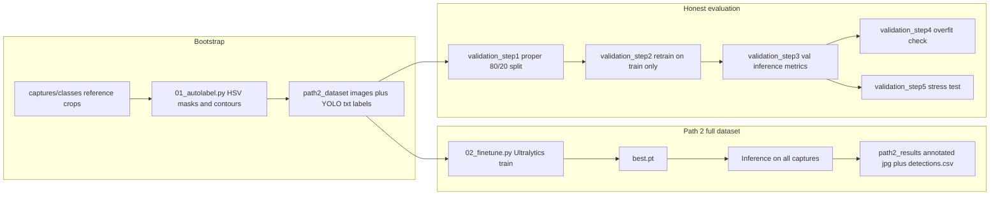

# Path 2 Switch Proposal (Stage B)

This folder is a concise review package for switching Stage B from HSV-only detection to a YOLO model trained from Stage A auto-labels.

## Was training data auto-labeled?

Yes. Bounding boxes are **not** hand-drawn in a labeling tool. They are produced automatically by `scripts/01_autolabel.py` using the same **isolated HSV color detection** logic as the Stage A baseline (weak supervision).

### How labeling works

1. **Reference crops** — Small reference images per class live under `path2_switch_proposal/captures/classes/` (e.g. `red.jpg`, `green.jpg`, `blue.jpg`). The script reads HSV from those crops.
2. **Per-class HSV ranges** — For each color it derives hue centers (circular mean on saturated pixels), saturation/value floors (percentile-based), and builds OpenCV `inRange` windows with hue wrap-around handling for red.
3. **Full-frame detection** — On each capture `.jpg` in `path2_switch_proposal/captures/` (top level only; same folder as `classes/`), it converts BGR→HSV, masks per class, morphological open/close, finds external contours, filters by area, aspect ratio, solidity, and ignores detections too close to the frame edge (~12% border).
4. **YOLO format** — Each accepted box is written as one line: `class cx cy w h` (normalized center and size) in `scripts/path2_dataset/labels/*.txt`, with images copied to `scripts/path2_dataset/images/`. Class ids: `0=red`, `1=green`, `2=blue`.

Errors in HSV masks (missed balloons, merged blobs, wrong color) become **noisy training labels**. That is why the validation scripts re-split data, retrain, and measure against held-out auto-labels plus stress tests—not just in-distribution mAP on the same auto-labels used to train.

## YOLO pipeline (end to end)

1. **Auto-label** — Run `01_autolabel.py` to build `path2_dataset/` (images + `.txt` labels + `dataset.yaml` + `autolabel_summary.txt`).
2. **Fine-tune (full stack)** — Run `02_finetune.py`: loads `yolo11n.pt`, trains on that dataset (same images used for train and val in this script’s generated `dataset_abs.yaml`), saves weights under `scripts/path2_training/balloon_finetune/`, runs inference on every capture, writes `path2_results/detections.csv` and **annotated frames** under `path2_results/annotated/` (white rectangles and `conf=…` text drawn with OpenCV).
3. **Honest split path** — `validation_step1_proper_split.py` copies the auto-labeled set into `scripts/dataset/` with `images/train`, `images/val`, and matching `labels/`. `validation_step2_retrain.py` trains only on the train split and reports best **mAP50 on the real val split** (`honest_map50.txt`). `validation_step3_val_inference.py` loads `training/balloon_proper/weights/best.pt`, runs the val images, matches predictions to auto-label GT at IoU 0.5, writes **`scripts/val_annotated/*.jpg`** (boxes and `class:conf` overlays), and writes `honest_results.txt`. Steps 4–5 add loss-gap and noise-stress checks.

Ultralytics also emits validation artifacts (curves, confusion matrices, **`val_batch*_labels.jpg` / `val_batch*_pred.jpg`**) when `model.val()` runs. For this repo, **`validation_step3_val_inference.py` and `regenerate_val_grids.py` save those under the Path 2 scripts tree** (`balloon_ultralytics_runs/val/`), not under an ambiguous repo-root `runs/detect/val` that might have been produced by unrelated `yolo val` commands (for example COCO demos).

## Sample annotated outputs

What you can open as **concrete examples** depends on what you have run locally. All paths below are **balloon (red / green / blue)** outputs only:

| Artifact | What it shows | Typical location |
|----------|----------------|------------------|
| **Val batch: ground truth** | Grid of **held-out val** images with YOLO label files drawn. | After step 3 or `regenerate_val_grids.py`: `path2_switch_proposal/scripts/balloon_ultralytics_runs/val/val_batch0_labels.jpg` (and further batches if the val set is larger than one batch) |
| **Val batch: predictions** | Same tiles with the fine-tuned model’s boxes. | `path2_switch_proposal/scripts/balloon_ultralytics_runs/val/val_batch0_pred.jpg` |
| **Path 2 full inference** | Every capture with finetuned detections (`conf=…`). | After `02_finetune.py`: `path2_switch_proposal/scripts/path2_results/annotated/` |
| **Held-out val overlays** | Val-only images with class and score (`0:0.92` style). | After `validation_step3_val_inference.py`: `path2_switch_proposal/scripts/val_annotated/` |

Ultralytics would pack up to **16** images per mosaic by default; we call `apply_plot_max_subplots(4)` so each `val_batch*.jpg` shows **at most four** larger tiles. Rebuild the balloon val mosaics after training (same weights and `dataset_abs.yaml` as step 3):

`python yolo_comparison_test/path2_switch_proposal/scripts/regenerate_val_grids.py` (optional `--weights` / `--data`; defaults are `scripts/training/balloon_proper/weights/best.pt` and `scripts/dataset/dataset_abs.yaml`). The script **refuses COCO / coco8-style data paths** unless you pass `--i-know-this-is-not-balloon-data`.

## Why Switch

- Stage A HSV baseline was useful for bootstrapping labels and pipeline logic.
- Path 2 (fine-tuned YOLOv11n) outperformed zero-shot COCO ball detection in our data.
- Honest held-out validation remained high after a proper train/val split, indicating the result is not just memorization.

## Core Evidence

- `results/path2_summary.txt`
  - Full-dataset Path 2 run summary.
- `results/honest_map50.txt`
  - Held-out validation mAP50 after proper 80/20 split retraining.
- `results/honest_results.txt`
  - Manual TP/FP/FN, precision, recall, F1, per-class breakdown, verdict.
- `results/stress_test_results.txt`
  - UAV-noise stress test retention and confidence drop.

## Scripts Included

- `scripts/01_autolabel.py`
  - Auto-labels from HSV to YOLO format (red/green/blue classes).
- `scripts/02_finetune.py`
  - Fine-tunes YOLOv11n on auto-labeled data.
- `scripts/validation_step1_proper_split.py`
  - Builds reproducible 80/20 split (`seed=42`).
- `scripts/validation_step2_retrain.py`
  - Retrains YOLOv11n from base weights on train split only.
- `scripts/validation_step3_val_inference.py`
  - Held-out inference + TP/FP/FN metrics + per-class metrics.
- `scripts/validation_step4_overfit_check.py`
  - Train-vs-val loss curve analysis and gap verdict.
- `scripts/validation_step5_stress_test.py`
  - UAV-noise robustness test on held-out validation images.
- `scripts/ultralytics_plot_patch.py`
  - Caps Ultralytics `plot_images` mosaics at four subplots (used by training/val scripts above).
- `scripts/regenerate_val_grids.py`
  - Re-runs `model.val()` for Path 2 only; writes `val_batch*.jpg` under `scripts/balloon_ultralytics_runs/<name>/` (defaults: weights + `dataset_abs.yaml`; blocks COCO/coco8 paths).

## Recommendation

Proceed with Path 2 as Stage B:

- Use HSV auto-labeling only as weak-supervision bootstrap.
- Use YOLO fine-tune + held-out validation as the primary detector path.
- Keep HSV as fallback/sanity check in difficult lighting scenarios.
